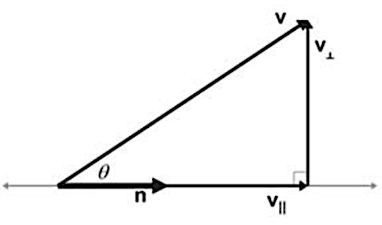

[TOC]

# 一、向量

##1. 概念

- 起点是原点
- 向量 = 方向 + 大小
- **位置移动** 的数值记录
- **线性变换** 的数值记录

##2. 基本运算 

- 向量的加减
  
  ​
- 向量的缩放
  
  ​

## 3. 向量的基（单位向量）

- 向量的长度：$||v|| = \sqrt{x^2 + y^2 +z^2}$
- 向量的基 == 单位向量：$({x \over ||v||},{y \over ||v||},{z \over ||v||})$
- 向量的值 **依赖** 于基
  
- 向量空间的一个基是 **张成** 该空间的 **线性无关** 向量集

## 4. 零向量

概念：

- 表示没有位移
- 零向量没有方向
- 每个维度都为 0 的向量
  例：在三维空间的零向量为 (0, 0, 0)

# 二、张成空间（向量的表示范围）

## 1. 概念

- 二维的张成空间
  

- 三维的张成空间
  
  

## 2. 线性相关

- 线性相关：有多组向量构成张成空间，移除其中一个 **不减少** 张成空间的大小
  线性无关：所有向量 给张成空间增添了新的维度
- 线性相关：多组向量中，有向量 = 其他向量的线性组合
  
- 齐次向量：表示同一条直线的一类向量

# 三、线性变换（矩阵）

## 1. 概念

- 实质：操作空间的一种手段

- 原点固定

- 直线在变换后保持直线

- 网格保持 **平行** 且 **等距分布**
  

## 2. 矩阵 * 向量（点的状态变化）

- 实质：求该向量**基坐标变化后（矩阵）的值**

- 线性变换后的基坐标 == 矩阵
  

- 矩阵 * 向量 == 该向量对应 **基坐标的线性变换** 后的值
  

- 向量 * 矩阵
$$
\begin{bmatrix}
x & y
\end{bmatrix}
\begin{bmatrix}
\color{green}{a} & \color{red}{b}\\
\color{green}{c} & \color{red}{d}
\end{bmatrix}
=
\begin{bmatrix}
x \color{green}{a}+y \color{red}{c} 
& 
x \color{green}{b}+ y\color{red}{d}
\end{bmatrix}
$$

## 3. 矩阵相乘（基坐标的状态变化）

- 实质：先后切换**基坐标**的状态
  例子：矩阵B * 矩阵A * 向量C == 将向量C **先按照 矩阵A 变换**，再按照矩阵B 变换
  

- 矩阵相乘**不遵循**交换律

  例子：矩阵B * **矩阵A** != **矩阵A** * 矩阵B

- 矩阵相乘结合律：(AB) C == A (BC)
  由于**都是从 最右边的 C 开始变换**，从几何角度看没有区别

- 矩阵相乘公式
  

# 四、行列式（面积/体积）

## 1. 概念

- 二维表示：二维行列式中两个二维向量构成的 **面积**
  **符号取决于** 区域是否发生了翻转变换（翻转为 负）
  行列式的值与所选坐标系无关
  

- 三维 表示：三维行列式中三个三维向量构成的 **体积**
  **符号取决于** 构成矩阵的这三个向量**是否满足右手定则**（不满足为 负）
  

## 2. 特殊情况

- 当线性变化后 区域 **面积** 为 0 时（点，线）
  说明发生了由 **高维到低维** 的线性变换
  

- 当线性变化后 区域 **体积** 为 0 时（点，线，面）
  

- 当线性变化后 比例为 **负数**  时，平面翻转
  

## 3. 公式
- 

#五、矩阵和线性方程组（计算工具）

## 1. 线性方程组 转 矩阵

- 求线性方程组的解，就是求线性变化的向量
 

## 2. 列空间

- **零向量** 一定在列空间中（因为线性变换必须保持原点不变）
 

## 3. 秩

- 实质：线性变换后空间的 **维数**
- 定义：列空间的维数
- 满秩：秩 == 列数

## 4. 零空间

- 当一个矩阵不是满秩的时候，会出现零空间
- 实质：线性变换后落在原点的集合
- 当线性方程组线性变换前 **V 向量为 0 时**，零空间就是该线性方程组 **解的集合**

## 5. 逆矩阵

- 前提：矩阵的行列式的值不为 0
- 可以利用矩阵的逆阵求解方程组。
- 实质：矩阵A 线性变换后，在变换矩阵A 的逆矩阵，向量的基不变。且无论先后顺序，向量的基都不变。（恒等变换）
   
   
##6. 转置矩阵

- 定义：若 $V_1 \times V_2 = M$ ，则 M 的转置矩阵 $M^T = V_2 \times V_1$
  例：
  $$
  \begin{array}{cc}
  \begin{bmatrix}
  1 & 2 & 3\\
  4 & 5 & 6\\
  7 & 8 & 9\\
  10 & 11 & 12
  \end{bmatrix}^T =
  \begin{bmatrix}
  1 & 4 & 7 & 10\\
  2 & 5 & 8 & 11\\
  3 & 6 & 9 & 12\\
  \end{bmatrix}
  &
  \begin{bmatrix}
  1 & 2 & 3\\
  4 & 5 & 6\\
  7 & 8 & 9
  \end{bmatrix}^T = 
  \begin{bmatrix}
  1 & 4 & 7\\
  2 & 5 & 8\\
  3 & 6 & 9
  \end{bmatrix}
  \end{array}
  $$

##7. 正交矩阵（转置 = 逆）

- 定义：若 M 正交矩阵，则 $MM^T = I_{单位矩阵} \Rightarrow M^T = M^{-1}$
- 几何意义：矩阵每 行/列 向量互相垂直，矩阵每 行/列 向量都是单位向量
  

## 8. 非方阵

- 3 X 2 矩阵的几何意义：将 **二维** 空间映射到 **三维**空间上

# 六、向量的点积（两向量的相似度）

##1. 概念
- 数学计算，遵循乘法交换律

  $$
  \begin{bmatrix} 
  \color{green}{1} \\  \color{red}{2} \\ 
  \end{bmatrix} \cdot
  \begin{bmatrix} 
  \color{green}{3} \\  \color{red}{4} \\ 
  \end{bmatrix} = \color{green}{1} \cdot \color{green}{3} + \color{red}{2} \cdot \color{red}{4}
  $$

- **应用：求向量的夹角**
  $||\vec v|| 是 \vec v 的长度，如果 \vec v是单位向量，||\vec v|| = 1$
  $$
  \vec v \cdot \vec n = ||\vec v|| \cdot ||\vec n|| \cdot cos\theta \\
  \theta = arccos({\vec v \cdot \vec n \over ||\vec v|| \space ||\vec n||})
  $$

- 几何解释
  点积，表示两个向量的相似程度，点积的值越大，两个向量越相似

  | v 和 n 点积 | v 和 n 的夹角 | v 和 n 的方向 |
  | :---------: | :-----------: | :-----------: |
  |    \> 0     |   [ 0，90 )   |   基本相同    |
  |     = 0     |      90       |   互相垂直    |
  |     < 0     |  ( 90，180 ]  |   基本相反    |

## 2. 点积和投影

给定两个向量 v 和 n，能将 v 分解成两个分量： $v_{||}$ 平行于 n 和 $v_{\bot}$ 垂直于 n 
$$
{v_{||} \over ||v_{||}||} = {n \over ||n||}, \space 
cos \theta = {||v_{||}|| \over ||v||}\\
\begin{align}
v \space 到 \space n \space 的投影：v_{||} &= ||v_{||}|| {n \over ||n||} = {n \over ||n||}||v||cos \theta = n{||n||||v||cos \theta \over ||n||^2} = n{v \cdot v \over ||n||^2}\\
v_{\bot} &= v - v_{||} = v - n{v \cdot v \over ||n||^2}
\end{align}
$$

$W \cdot V = 长度_{W 到 V 的投影} \times 长度_V$

##3. 点积可以是一种线性变换

1. 二维向量 线性变换到 一维向量
  例：设，二维向量（4，3）【基向量为（1，1）】
  经过基向量变化（1，-2）到一维向量上为 -2【基向量为（1，-2）】
  则，点积的过程可以看作 维度由高到底的 线形变换
  $$
  \begin{align}
  M_{1\times 2 矩阵} \cdot v_{前} &= N_{点积结果} \\
  V_{点积用向量} \cdot v_{前} &= N_{点积结果} \\
  M_{1\times 2 矩阵} &= V_{点积用向量}
  \end{align}
  $$
  

2. 进一步说明
  有时，为求由高维到低维的 1 X 2 变换矩阵 M $\begin{bmatrix}u_x & u_y\end{bmatrix}$
  一维上的一个向量 u，到基坐标 j 的正交投影值 $u_y$ ，利用对称性可知：
   $u_y$ 等价于 基坐标 j 到 向量 u 上的正交投影值，即
   $u_y$ 等价于 就是变换矩阵M 的 y 值
  

3. 结论

  1 X 2 矩阵M 这样的由二维到一维的线性变换过程 可以用 向量 m 表示，并且 **矩阵M 和 向量m** 一一对应
  

# 七、向量的叉乘（基向量，向量组合的行列式）

## 1. 概念

- **几何解释**
  二维空间：通过 2 个向量叉乘得到这 2 个向量构成的面积（面积也有负，取决于叉乘的顺序）
  三维空间：通过 2 个向量叉乘得到 1 个**垂直于这两个向量平面的向量**

  

- 叉乘的计算
  二维空间：两个向量组合成的矩阵的**行列式值 det**（矩阵的转置矩阵不改变行列式的值）

  

  三维空间：特殊的行列式求法，其中 $({\hat x},{\hat y},{\hat z})$ 为基向量
  $$
  \begin{bmatrix} 
  \color{green}{v_1} \\  \color{red}{v_2} \\ \color{blue}{v_3}\\ 
  \end{bmatrix} \times
  \begin{bmatrix} 
  \color{green}{w_1}  \\ \color{red}{w_2} \\ \color{blue}{w_3} \\ 
  \end{bmatrix} = 
  \begin{bmatrix} 
  \color{red}{v_2} \cdot  \color{blue}{w_3} - \color{blue}{v_3}\cdot \color{red}{w_2} \\
  \color{blue}{v_3} \cdot  \color{green}{w_1} - \color{green}{v_1}\cdot \color{blue}{w_3} \\
  \color{green}{v_1} \cdot  \color{red}{w_2} - \color{red}{v_2}\cdot \color{green}{w_1} \\
  \end{bmatrix}
  \\ \Downarrow \\
  \begin{bmatrix} 
  \color{#F80}{v_1} \\  \color{#F80}{v_2} \\ \color{#F80}{v_3}\\ 
  \end{bmatrix} \times
  \begin{bmatrix} 
  \color{#F0F}{w_1}  \\ \color{#F0F}{w_2} \\ \color{#F0F}{w_3} \\ 
  \end{bmatrix} = 
  det
  \begin{pmatrix} 
  \begin{bmatrix} 
  \color{green}{\hat x}  & \color{#F80}{v_1} & \color{#F0F}{w_1} \\
  \color{red}{\hat y}  & \color{#F80}{v_2} & \color{#F0F}{w_2} \\ 
  \color{blue}{\hat z}  & \color{#F80}{v_3} & \color{#F0F}{w_3} \\ 
  \end{bmatrix} 
  \end{pmatrix}
  \\ \Downarrow \\
  \begin{align}
  \color{#F80}{\overrightarrow V} \times \color{#F0F}{\overrightarrow W}
  &= 
  \color{green}{\hat x}(\color{#F80}{v_2} \cdot  \color{#F0F}{w_3} - \color{#F80}{v_3}\cdot \color{#F0F}{w_2}) + 
  \color{red}{\hat y}(\color{#F80}{v_3} \cdot  \color{#F0F}{w_1} - \color{#F80}{v_1}\cdot \color{#F0F}{w_3}) + 
  \color{blue}{\hat z}(\color{#F80}{v_1} \cdot  \color{#F0F}{w_2} - \color{#F80}{v_2}\cdot \color{#F0F}{w_1})\\
  &= \overrightarrow S_{垂直于V 和 W 构成的平面}
  \end{align}
  $$

- 叉乘向量的方向（具体见 Part1 十、1.1.4）：
  在右手坐标系下，使用 [**右手定则**](https://en.wikipedia.org/wiki/Right-hand_rule) 判断叉乘的方向
  在左手坐标系下，使用 **左手定则** 判断叉乘的方向

- 叉乘向量的长度
  几何意义：叉乘得到的向量长度 = 两个向量构成的平行四边行的面积
  公式：$||a \times b|| = ||a||\space||b|| sin\theta$
  $ a \times b = 0 $ 表示 a 平行于 b

 

## 2. 三维空间中叉乘的线性变换解释

1. 构造 三维 到 一维的**线性变换**
   函数：由第一列的向量的三个坐标做变量，v 和 w 向量值固定，得到一个行列式的值（三个向量构成的六面体的体积）

   

2. 由于函数线性，就会存在一个 1 X 3 矩阵来代表这个变换

$$
\begin{bmatrix} \color{red}{p_1} &  \color{red}{p_2} & \color{red}{p_3}\\ \end{bmatrix} \cdot 
   \begin{bmatrix} x \\ y \\ z\\ \end{bmatrix} =  
   det
   \begin{pmatrix} 
   \begin{bmatrix} 
   x & \color{green}{v_1} & \color{#F80}{w_1} \\
   y & \color{green}{v_2} & \color{#F80}{w_2} \\ 
   z & \color{green}{v_3} & \color{#F80}{w_3} \\ 
   \end{bmatrix} 
   \end{pmatrix}
$$

3. 从多维到一维的线性变换矩阵可以用向量代替（见 六.2）
$$
\begin{bmatrix} \color{red}{p_1}\\ \color{red}{p_2}\\ \color{red}{p_3}\\ \end{bmatrix} \cdot 
\begin{bmatrix} x \\ y \\ z\\ \end{bmatrix} =  
det
\begin{pmatrix} 
\begin{bmatrix} 
x & \color{green}{v_1} & \color{#F80}{w_1} \\
y & \color{green}{v_2} & \color{#F80}{w_2} \\ 
z & \color{green}{v_3} & \color{#F80}{w_3} \\ 
\end{bmatrix} 
\end{pmatrix} 
\\ \Downarrow \\
\color{red}{p_1} \cdot x +  \color{red}{p_2} \cdot y +  \color{red}{p_3} \cdot z = x(\color{green}{v_2} \cdot  \color{#F80}{w_3} - \color{green}{v_3}\cdot \color{#F80}{w_2}) + 
 y(\color{green}{v_3} \cdot  \color{#F80}{w_1} - \color{green}{v_1}\cdot \color{#F80}{w_3}) + 
 z(\color{green}{v_1} \cdot  \color{#F80}{w_2} - \color{green}{v_2}\cdot \color{#F80}{w_1})
\\ \Downarrow \\
\color{red}{p_1} = \color{green}{v_2} \cdot  \color{#F80}{w_3} - \color{green}{v_3}\cdot \color{#F80}{w_2} \\
\color{red}{p_2} = \color{green}{v_3} \cdot  \color{#F80}{w_1} - \color{green}{v_1}\cdot \color{#F80}{w_3} \\
\color{red}{p_3} = \color{green}{v_1} \cdot  \color{#F80}{w_2} - \color{green}{v_2}\cdot \color{#F80}{w_1}
\\ \Downarrow \\
\overrightarrow P = \overrightarrow V \times \overrightarrow W
$$

4. 假设 空间内有一向量 P 垂直于 v 和 w 构成的平行四边形 F，且 P 的长度为 F 的面积
  $$
  \begin{align} \\
    P \cdot x  &= x 在 P 的投影 \times P 的长度（见 六.1）\\
    &= X 在 P 的投影 \times F_{v 和 m 构成的平行四边形面积} \\
    &= x, w, v 构成的六面体的体积
    \end{align}
  $$
  

5. 由 3 得 P 为 向量 V 和 W 的叉乘结果
   由 4 得 存在 P‘ 垂直于 向量 V 和 W 构成的平面
   由 2 得 P 和 P’ 一一对应（见 六、2.3）

#八、基变换（坐标系转换）

##1. 概念

- 基向量：**基向量的比值**可以表示坐标系中的任何向量
- 变换前提：同一原点
- 几何意义：实现 **同一个向量** 在不同 **基向量（坐标系）**下的转换

  > 例，一个模型上的点都是基于模型上原点的偏移量 A（此时模型原点值是 M（ 0，0，0））
  > 当把模型放到世界中，移动模型时，模型上的原点是基于世界原点的偏移量（此时模型原点值是 N（ x，y，z），基坐标已经变化）
  > 此时求得：模型的点在世界坐标的值 = 偏移量 A + 模型原点在世界坐标的值 N

##2. 不同坐标系的互相转换

本质：变换后的向量原来由基向量构成的线性组合不变，但使用新的基向量

目标 1：A 坐标系的向量 v 转 B 坐标系的向量 w

- 公式 1：矩阵左乘法（三、2）
  向量 v：A 坐标系中的向量
  向量 w：向量 v 在**B 坐标系中**对应的向量
  矩阵 M：A 坐标系的基向量在 B 坐标系的表示
  $$
  \begin{align}
  \overrightarrow M_{ab} \cdot \overrightarrow v_a &= \overrightarrow w_b \\
  \overrightarrow v_a &= {\overrightarrow M_{ab}}^{-1} \cdot \overrightarrow w_b
  \end{align}
  $$
  

目标 2： B 坐标系的线性变换（矩阵 P）转 A 坐标系的线性变换（矩阵 Q）

- 公式 2：矩阵与矩阵相乘（三、3）
  向量 v： A 坐标系中的向量
  向量 w：向量 v 的在 B 坐标系线性变换后的在 A 坐标系的结果
  矩阵 M：A 坐标系的基向量在 B 坐标系的表示
  矩阵 P：向量 v 在 B 坐标系的线性变换
  $$
  \begin{align}
  \overrightarrow M^{-1}_{ba} \cdot 
  \color{red}{\overrightarrow P_b} \cdot 
  \color{red}{\overrightarrow M_{ab}} \cdot 
  \overrightarrow v_a &= \overrightarrow w_a \\
  \overrightarrow Q_a \cdot 
  \overrightarrow v_a &= \overrightarrow w_a \\
  \end{align}
  $$

#九、特征向量与特征值

## 1. 概念

- 几何意义：
  特征向量：向量在 **线性变换前后** 向量的 **张成空间（二、1）不变**（与所选坐标系无关）
  特征值：$特征值 = {特征向量线性变换后的长度 \over 特征向量线性变换前的长度}$，向量翻转时特征值为负
- 特殊情况：
  部分旋转的线性变换 **没有特征值和特征向量**
  属于单个特征值的特征向量可能不止在一条线上
  
- 公式：
  矩阵 A：变换矩阵
  矩阵 I：单位矩阵
  向量 v：特征向量
  lambda：特征值
$$
\begin{align}
A \overrightarrow v &= \lambda \overrightarrow v \\
A \overrightarrow v &= \lambda  
\begin{bmatrix} 
1 & 0 & 0\\
0 & 1 & 0\\
0 & 0 & 1\\
\end{bmatrix}
\cdot
\overrightarrow v \\
(A - 
\begin{bmatrix} 
\lambda & 0 & 0\\
0 & \lambda & 0\\
0 & 0 & \lambda\\
\end{bmatrix}
) \cdot \overrightarrow v &= 0 \\
\\
(A - \lambda I) \cdot \overrightarrow v &= 0 \\
\end{align}
$$

 - 求解：
   特征向量 v 为 0，上述公式恒成立
   特征向量 v 非 0，可知 **矩阵 [ A - lambda * I ] **的 **行列式** 值为 0（四、2），可以求出 特征值，然后代入公式求特征向量

## 2. 应用

- 特征向量作为旋转轴：**（特征值必须 == 1）**
  由于特征向量在线性变换后不影响其方向，可以**作为旋转轴**
- 对角矩阵：
  除了对角元素以外其他元素均为 0 的矩阵
  所有基向量 都是 特征向量，对角元素之积是 特征值
  多次相乘对角矩阵容易计算
- 特征基：
  几个特征向量的张成空间是基向量的张成空间，这几个特征向量可以作为基向量使用
- 降低矩阵计算量：
  对于部分矩阵，如果特征基存在，通过基变换（八、2）选取特征基作为新的基向量，可以得出对角矩阵，在利用对角矩阵易计算的特性，降低计算量
  例：
  X 轴上的基向量由 (0, 1) 到 (0, 1)
  Y 轴上的基向量由 (1, 0) 到 (-1, 1)
  $$
    { \begin{bmatrix} 
    \color{green}{1} & \color{#FA0}{-1}\\ 
    \color{green}{0} & \color{#FA0}{1}\\
    \end{bmatrix} 
    }^{-1}\cdot 
    \begin{bmatrix} 
    \color{green}{3} & \color{red}{1}\\ 
    \color{green}{0} & \color{red}{2}\\
    \end{bmatrix} 
    \cdot
    \begin{bmatrix} 
    \color{green}{1} & \color{#FA0}{-1}\\ 
    \color{green}{0} & \color{#FA0}{1}\\
    \end{bmatrix} 
    = 
    \begin{bmatrix} 
    \color{red}{3} & 0\\ 
    0 & \color{red}{2}\\
    \end{bmatrix}
  $$

