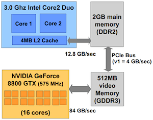
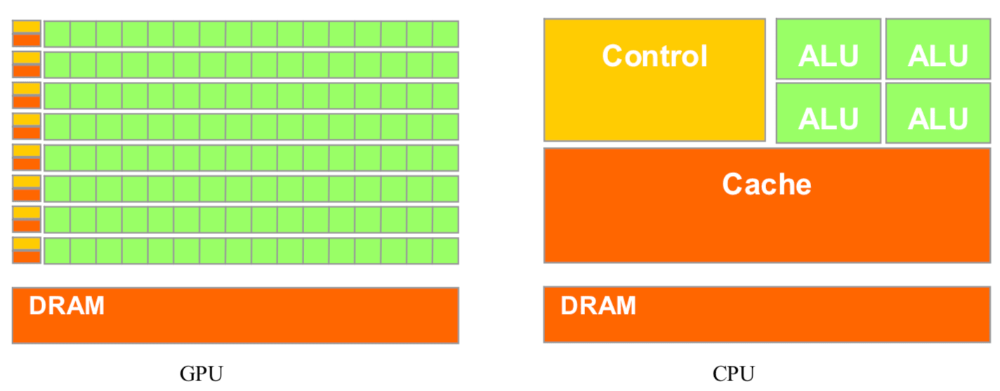
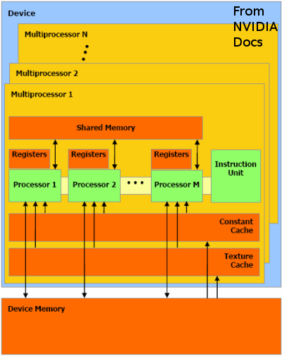
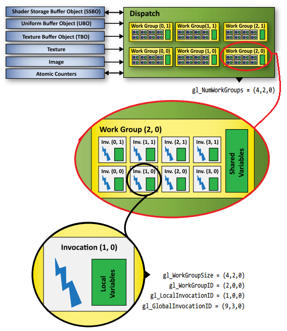
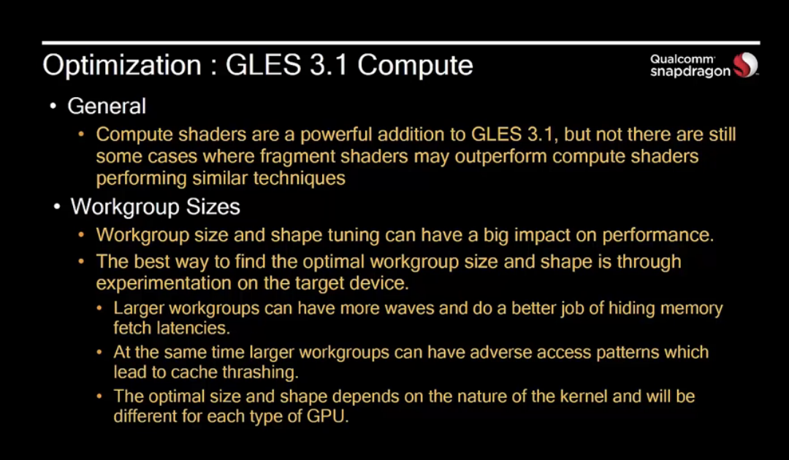

[TOC]

# 一、 图形硬件

## 1. GPU 的硬件结构

GPU 所处的环境：计算机的硬件结构如下

- 显存的带宽比内存的大很多（显存的位宽大）

- **内存** 和 **显存** 之间的 PCI 总线带宽过小是 CPU 和 GPU 交互的瓶颈

  > OpenGL 的**显示列表**，将一组绘制指令放到 GPU 上，CPU 只要发一条 "执行这个显示列表" 这些指令就执行，而不必每次渲染都发送大量指令到 GPU，从而节约 PCI 带宽 
  >
  > 在移动端，带宽是一种多设备（CPU、GPU、AUDIO 等）共享的资源，而且**处理器通过带宽对存储的访问很耗电**



相对于全面功能考虑的 CPU，GPU 有更多的 ALU（Arithmetic Logic Unit，逻辑运算单元），更少的逻辑控制单元和寄存器



GPU 在 shader 中进行的向量运算采用 SIMD 或 MIMD 计算方式

> SISD（Single Instruction Single Data Stream，单指令单数据流）：传统顺序执行计算机使用
>
> MIMD（Multiple Instruction Stream Multiple Data Stream，多指令多数据流）：现代大多数计算机使用，使用多个控制器来异步地控制多个处理器，从而实现空间上的并行性。从硬件角度看，MIMD 需要消耗大量的晶体管数
>
> SIMD（Single Instruction Stream Multiple Data Stream，单指令多数据流）：GPU 内置计算方式，CPU 里也有相应的实现方法
>
> MISD（Multiple Instruction Stream Single Data Stream，多指令单数据流）


### 1.1 GPU 硬件模型

GPU 的并行运算：与 CPU 上十几个线程的并行计算不同，GPU 的线程数可以达到上百万或更多

GPU 主要由 **显存(Device Memory)** 和 **流多处理器(Stream Multiprocessors)** 组成




### 1.2 [CUDA](http://eric_rollins.home.mindspring.com/ray/cuda.html) 的执行模型，[以 PTX ISA 为例](https://docs.nvidia.com/cuda/parallel-thread-execution/index.html)

- 将线程按 Grid、Block 两个层次分组，如下图
  Host：CPU 编程视图
  Device：GPU 编程视图
  

- Grid 存储模型，如下图
  Block 总在一个 GPU 的流多处理器上执行
  Block 间，线程通过全局存储（显存）通信
  Block 内，线程通过共享存储（由流多处理器的共享存储器提供）通信
  


### 1.3 OpenGL 的执行模型

- 将线程按 Dispath、Work Group、Invocation 三个层次分组，如下图
其中，Dispath 类似于 CUDA 的 Grid，Work Group 类似于 CUDA 的 Block
  


## 2. GPU 硬件渲染模式

> 对功耗影响最大的是带宽

**IMR（Immediate Mode Rendering）立即渲染模式**

- PC 上常见的渲染模式，功耗大，速度快
- 每个渲染命令都会立即开始
- 遮蔽处理的部分**会**被渲染处理器
- 流程
  


**TBR（Tile Based Rendering）贴图渲染**

- **移动端 GPU 常用的渲染模式，功耗低，速度慢**
- 将渲染的一帧缓存分成一个个的区块（tile）
  当提交渲染命令的时候，GPU 不会立刻进行渲染，而是一帧内所有的渲染命令积攒起来，最后统一渲染。
  每次 GPU 通过中间缓冲器 [SRAM](https://baike.baidu.com/item/SRAM/7705927?fr=aladdin) 访问 [DRAM](https://baike.baidu.com/item/DRAM) 显存上的一小块区块执行渲染命令以降低带宽
- 遮蔽处理的部分**会**被渲染器处理
- 流程
  


**TBDR（Tile Based Deferred Rendering）贴图延迟渲染**

- 基于 TBR 贴图渲染的低功耗优势 [具体说明](https://en.wikipedia.org/wiki/Tiled_rendering)
- 遮蔽处理的部分**不会**被渲染器处理
- 流程
  


## 3. 性能优化

### 3.1 基本优化

1. 渲染更少的像素
   要注重渲染的像素的质量而非数量，1280 X 720 是针对中低端手机比较理想的分辨率
   后处理的场景可以用原图尺寸的一半或更低的分辨率 FBO 来渲染
   UI 界面可以用低分辨率的小部件拼接起来，渲染在高分辨率的 FBO 

2. 减少 draw call 的次数
   使用共享的 shader 和共享的绘制状态（例：多个纹理文件合并为一个地图纹理集）

3. 减少带宽的使用
   设置最大纹理限制
   在渲染少量像素时用更小的纹理（采用 mipmap）
   采用纹理压缩技术压缩纹理

   | 绘图 API      | 推荐纹理压缩格式 |
   | ------------- | ---------------- |
   | OpenGL ES 2.0 | ATC or ETC1      |
   | OpenGL ES 3.0 | ETC2             |
   | OpenGL ES 3.1 | ETC2 or ASTC     |
   | Vulkan        | ETC2 or ASTC     |

4. 尽量将多个 VBO 一次更新完后再绘制

5. shader 代码性能的优化
   shader 16 bit 精度（mediump）比 32 bit 精度（highp）快很多，建议默认设为 mediump 精度
   减少对不必要的通道的使用，通过对通道的排序，减少对通道不必要的占用

6. Tessellaion（曲面细分的优化）

   - 过高的曲面细分会产生亚像素的三角形，可以通过距离、屏幕空间等方法改变传递细分因子的值来避免
   - 对于要剔除的背面可以不进行曲面细分
   - 通常可以 disable 掉 TCS 和 TES 阶段的曲面细分，减少 GPU 不必要的阶段

7. GLES 3.1 的 Compute shader
   


### 3.1 基于 Frame buffer object 的优化
基于 TBDR 的**移动端** FBO 优化

1. 尽量使用少的透明纹理
   TBDR 的优化 Hidden Surface Removal，会优化遮蔽的不透明纹理，透明纹理无法遮蔽，不会优化
2. 每次重新绘制前执行 clear
   IMR 立即渲染模式下，每一帧**不去**清屏可以提高效率（clear 操作需要将值写入 FramBuffer 中的每一个像素中）
   TBDR 贴图延迟渲染模式下清屏，表示丢弃上一帧的内容，如果上一帧的渲染命令还没有积攒完，这个时候可以立刻放弃上一帧数据


### 3.2 对渲染排序

为了减少 GPU 状态的改变和过度绘制的现象，需要对渲染排序

1. 排序材质的渲染次序（减少 shader 和 纹理状态的变化）
2. 对于不透明的 draw call 进行从前到后的排序（减少先渲染的结果被后渲染的覆盖，造成不必要的浪费）
3. 将天空盒这种被大部物体遮挡的情况放在最后渲染，可以减少不必要的渲染


### 3.3 丢弃深度和模版缓存

- 渲染完成后，GPU 通常会将图形缓存（GMEM）拷贝到 CPU 的系统缓存中。

- 这种拷贝十分耗时，大多数情况下只有色彩缓存只需要被拷贝回去。（深度缓存和模版缓存不需要再次拷贝）

- 在 OpenGL ES 中可以使用 `glInvalidateFramebuffer` 

  ```c++
  Glenum invalidList[] = {GL_DEPTH_ATTACHMENT, GL_STENCIL_ATTACHMENT};
  Glsizei invalidListCount = 2;
   
  glInvalidateFramebuffer(GL_FRAMEBUFFER, invalidListCount, invalidList)
  ```


# 引用

1. [移动 GPU 渲染模式](https://blog.csdn.net/u013467442/article/details/40684479)
2. [针对移动端 TBDR 架构 GPU 特性的渲染优化](https://blog.csdn.net/leonwei/article/details/79298381)
3. [GPU架构图](https://blog.csdn.net/pizi0475/article/details/7573996)